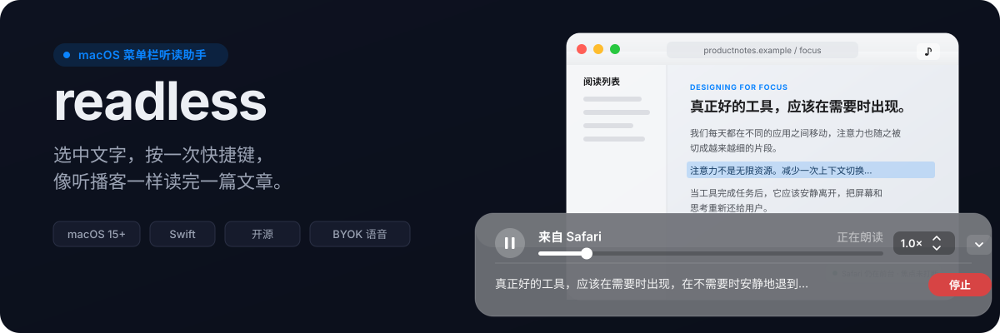
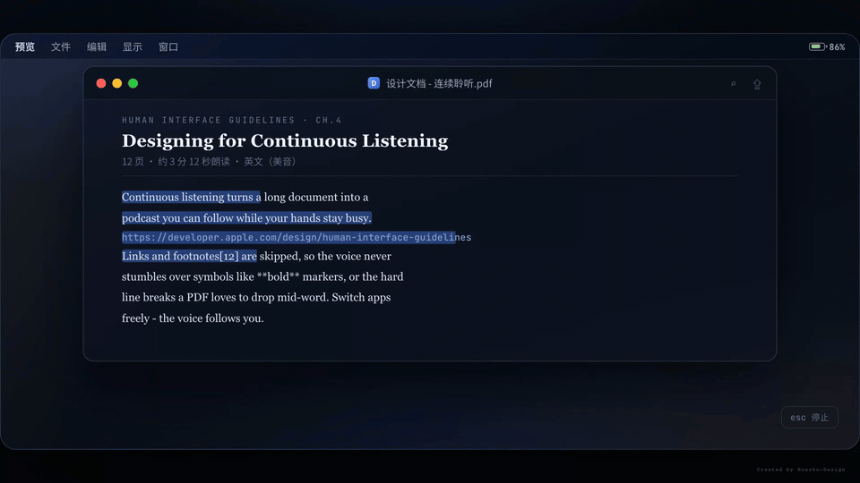
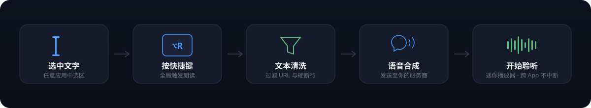

<p align="center">
  
</p>

<p align="center">
  中文 | <a href="./README_EN.md">English</a>
</p>

---

readless 是一个原生 macOS 菜单栏听读助手。在任意应用中选中文字，按一次快捷键，即可在 1.5 秒内听到经过清洗、可控速、可跨应用连续播放的语音朗读。

macOS 自带的朗读入口较深、播放控制有限，URL 和硬断行还会破坏听感。readless 解决的问题不是"让文字发声"，而是让你**像听播客一样把一篇文章顺畅听完**。

## 核心特性

- **一键朗读** — 在任意应用中选中文字，按 `⌥R` 触发朗读；再次按下暂停/继续，选中新文字则自动替换
- **朗读剪贴板** — 按 `⌥⇧R` 显式朗读剪贴板内容，不会在取词失败时静默回退
- **文本清洗** — 自动过滤独立 URL 行、合并 PDF 硬断行、识别 Tab 分隔表格并按通用读法朗读
- **跨应用连续播放** — 切换应用不中断朗读，迷你播放器不抢占键盘焦点
- **播放控制** — 进度条拖拽定位、倍速调节、按句跳转、Esc 停止，支持系统媒体键和 AirPods 控制
- **多语音服务商** — 支持 OpenAI、豆包（火山引擎）、阿里百炼，以及 OpenAI-compatible 自定义入口
- **凭证安全** - 所有 API 凭证存储在 macOS Keychain，不写入配置文件
- **最近朗读** - 本地保留最近 3 条朗读记录，可折叠展开，不上传任何数据

<p align="center">
  
</p>

## 工作流程

<p align="center">
  
</p>

readless 通过 Accessibility API 读取当前选区文字，经文本清洗后发送给你配置的语音服务商，合成音频后通过屏幕底部的迷你播放器播放。整个流程不监听剪贴板，不后台扫描选区，只在快捷键触发时读取。

## 安装

### 1. 下载安装包

从 [Releases](https://github.com/klosexf/readless/releases) 页面下载最新的 `.dmg` 文件。

### 2. 挂载并安装

双击打开 `.dmg` 文件，将 Readless 图标拖入右侧「应用程序」文件夹。

### 3. 首次启动

由于本应用未经 Apple 开发者签名，首次打开时 macOS 会阻止启动并提示「无法打开，因为无法验证开发者」。请按以下任一方式处理：

#### 方式一：右键打开（推荐）

1. 在「访达 > 应用程序」中找到 Readless
2. **按住 Control 键点击** Readless 图标（或右键点击）
3. 在弹出菜单中选择「打开」
4. 对话框中会显示「无法验证开发者身份」，点击「打开」即可

此操作只需执行一次，之后可正常双击启动。

#### 方式二：系统设置中允许

1. 尝试双击打开 Readless，弹出阻止提示后关闭
2. 打开「系统设置 > 隐私与安全性」
3. 在页面底部会出现「已阻止使用 Readless」，点击「仍要打开」
4. 输入密码确认后即可启动

#### 方式三：终端命令（如以上方式无效）

```bash
xattr -cr /Applications/Readless.app
```

此命令会移除应用的隔离属性标记，执行后双击即可正常打开。

> 以上操作不会影响系统安全设置，仅对本应用生效。Readless 是开源软件，可自行查看源码确认安全性。

### 4. 授权

首次使用朗读功能时，系统会提示授予「辅助功能」权限。请在「系统设置 > 隐私与安全性 > 辅助功能」中开启 Readless 的开关，否则无法读取选中文字。

### 从源码构建

```bash
git clone https://github.com/klosexf/readless.git
cd readless
open readless.xcodeproj
```

在 Xcode 中选择 `readless` scheme，`⌘R` 构建并运行。需要 macOS 15+ 和 Xcode 16+。

## 首次使用

首次启动后按引导完成四步配置：

1. **选择服务商** — 选择语音服务商并填写凭证，动态表单会解释每个字段
2. **播放测试句** — 验证凭证、网络和语音链路是否可用
3. **辅助功能权限** — 授权后 readless 才能在快捷键触发时读取选区
4. **练习触发** — 选中示例文字按 `⌥R`，成功后完成引导

> 链路验证通过后才会请求辅助功能权限，避免"已授权但服务不可用"的双重挫败。

## 语音服务配置

readless 采用 BYOK（Bring Your Own Key）模式，不自建语音服务。你选择的朗读文字会直接发送给你配置的语音服务商，凭证只保存在 macOS Keychain。

| 服务商 | 必填字段 | 说明 |
| --- | --- | --- |
| OpenAI | API Key（Base URL 可改） | 支持 tts-1 / tts-1-hd 等模型 |
| 豆包（火山引擎） | App ID、API Key、Cluster | 需填写"API Key 管理"中的 Key |
| 阿里百炼 | DashScope API Key、地域 | 支持 CosyVoice 系列模型 |
| OpenAI-compatible | API Key、Base URL | 兼容 OpenAI 接口的任意服务 |

在"语音服务设置"中切换服务商时，表单会动态变形，只显示该服务商需要的字段。

## 隐私

> 不上传到本项目服务器；你选择朗读的文字会发送给你配置的语音服务商。凭证只保存在 macOS 钥匙串。

- 选中文字和剪贴板内容只用于当前朗读流程，不写入日志、测试快照或持久化存储
- 不做远程遥测，不收集用量数据，不记录应用使用轨迹
- 最近朗读记录纯本地存储（最多 3 条），可随时关闭或清空
- Accessibility 取词失败时不会自动读取剪贴板，只有你主动点击"朗读剪贴板"才会读取
- 错误信息不包含选区原文、剪贴板内容或凭证片段

## 技术栈

| 层 | 技术 |
| --- | --- |
| UI | SwiftUI + AppKit |
| 语音 | AVFoundation + 云端 TTS API |
| 全局快捷键 | Carbon.HIToolbox |
| 选区读取 | Accessibility API |
| 并发 | Swift Concurrency（`@MainActor` 边界） |
| 测试 | SwiftPM + XCTest |
| 工程 | Xcode project（完整 App）+ SwiftPM（核心逻辑） |

### 架构

```
SwiftUI / AppKit 界面层
        ↓ actions / published state
AppDelegate + ReadingCoordinator
        ↓ protocols
System adapters（AX / Clipboard / Speech / Carbon）
```

- **View** 只发送 action、观察状态，不直接调用系统 API
- **ReadingCoordinator** 承载跨系统服务的朗读决策
- **Core**（`readless/Core/`）存放可复用纯逻辑，通过 SwiftPM 测试
- **System**（`readless/System/`）存放系统 adapter，通过协议注入

## 开发

```bash
# 运行核心测试
swift test

# 运行特定测试
swift test --filter ReadingCoordinatorTests
swift test --filter TextSanitizerTests

# 构建 SwiftPM 核心
swift build
```

> `swift test` 覆盖 `Package.swift` 暴露的 `ReadlessCore`。完整 App 构建使用 Xcode 打开 `readless.xcodeproj`。

### 项目结构

```
readless/
├── Package.swift              # ReadlessCore 与测试定义
├── Tests/ReadlessCoreTests/   # 核心单元测试
├── readless/
│   ├── AppDelegate.swift      # 依赖装配与运行时绑定
│   ├── AppState.swift         # UI/播放状态与中文文案
│   ├── Core/                  # 模型、协议、协调器、纯逻辑
│   ├── System/                # AX、Carbon、剪贴板、语音 adapter
│   ├── *View.swift            # SwiftUI 界面
│   └── *Controller.swift      # AppKit 窗口与菜单栏
├── readless.xcodeproj/        # 完整 macOS App 工程
└── assets/readme/             # README 视觉素材
```

## 兼容性

- 最低支持 **macOS 15**，正式目标为 Apple Silicon
- macOS 26+ 使用系统 Liquid Glass 材质；macOS 15–25 使用 `NSVisualEffectView` / SwiftUI `Material`
- 两档系统共享信息架构、窗口尺寸和交互逻辑，只切换材质实现
- 动效遵循"减少动态效果"系统设置

## 快捷键

| 快捷键 | 功能 | 说明 |
| --- | --- | --- |
| `⌥R` | 朗读选区 | 读取当前应用选区文字并朗读；播放中再按暂停/继续 |
| `⌥⇧R` | 朗读剪贴板 | 读取剪贴板内容并朗读 |
| `Esc` | 停止 | 停止朗读并收起迷你播放器 |

> 快捷键可在设置中自定义录制。冲突时自动恢复上一份可用配置。

## 贡献

欢迎提交 Issue 和 Pull Request。提交信息请使用中文，格式遵循「类型：简述」，如 `feat: 新增功能`、`fix: 修复问题`。

## License

MIT
